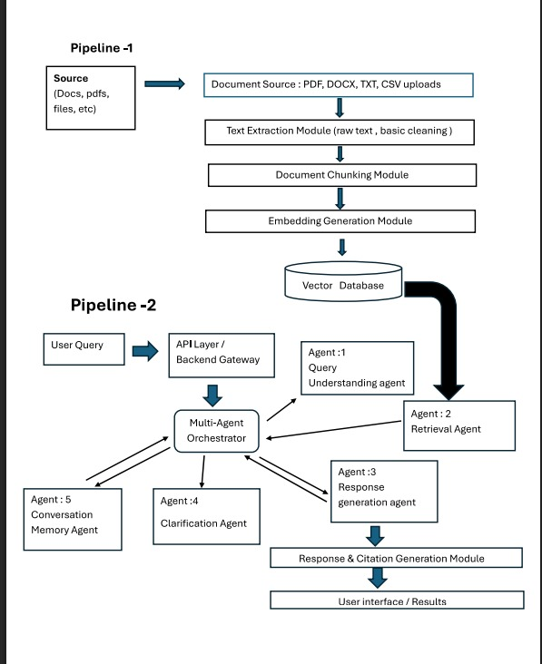
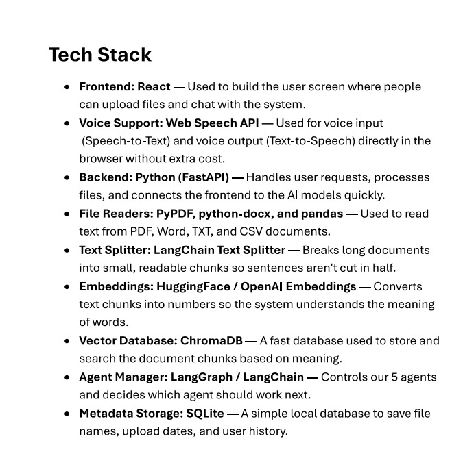

# AI Knowledge Retrieval Platform

A hands-on implementation of a Retrieval-Augmented Generation (RAG) platform. The system takes raw unstructured text, splits it into usable chunks, indexes embeddings into a vector database, and resolves user questions using context-guided LLM responses.

---

## What This Project Does

Standard language models often hallucinate or lack access to private documents. This project implements a modular retrieval pipeline to ground responses in actual reference material:
* Parses local documents into structured text blocks.
* Uses embedding models to capture semantic meaning instead of simple keyword matching.
* Stores and queries vector embeddings quickly using nearest-neighbor similarity.
* Chains retrieved context directly into the prompt so the model cites real facts.

---

## Architecture

The system follows a three-stage layout:
1. Ingestion: Reads source files and breaks them down using chunking boundaries.
2. Vector Indexing: Converts text chunks into numerical vectors and stores them on disk.
3. Orchestration: Takes a user query, finds the top matching passages, and feeds them into the generation model.

---

## System Workflow

1. User sends a query through the interface or API.
2. The orchestrator embeds the query using the configured embedding model.
3. The vector store searches for the most relevant document chunks.
4. The retrieved context and question are packaged into an explicit instruction prompt.
5. The LLM produces an answer strictly grounded in the supplied context.

---

## Repository Structure

ai-knowledge-retrieval-platform/
│
├── src/
│   ├── ingestion/
│   │   ├── document_parser.py    # Extracts clean text from raw files
│   │   └── chunker.py            # Recursive text splitting logic
│   │
│   ├── orchestration/
│   │   └── pipeline/
│   │       └── orchestrator.py   # Manages query flow and prompt assembly
│   │
│   └── vectorstore/
│       └── store.py              # Embedding generation and vector DB indexing
│
├── static/                       # UI assets and diagram images
├── docs/                         # Additional project notes and documentation
├── app.py                        # Application entry point
├── requirements.txt              # Core project dependencies
└── .gitignore                    # Python and environment ignore rules

---

## Setup and Installation

### 1. Set Up Virtual Environment
python -m venv venv

# Windows:
venv\Scripts\activate

# macOS / Linux:
source venv/bin/activate

### 2. Install Dependencies
pip install -r requirements.txt

### 3. Run the Platform
python app.py

---

